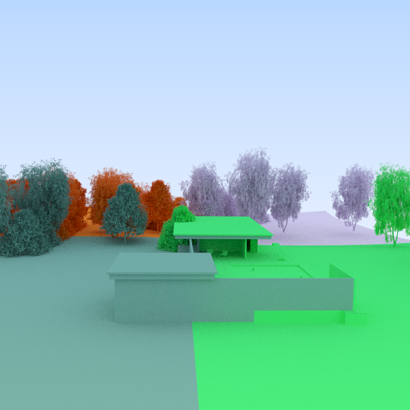

Finding Efficient Spatial Distributions for Massively Instanced 3-d Models
==========================================================================


Source code repository accompanying the scientific paper

"Finding Efficient Spatial Distributions for Massively Instanced 3-d Models".
-----------------------------------------------------------------------------

Stefan Zellmann, Nate Morrical, Ingo Wald and Valerio Pascucci

Eurographics Symposium on Parallel Graphics and Visualization (EGPGV 2020)

```
@inproceedings {ZellmannMorricalWaldPascucci:2020,
booktitle = {Eurographics Symposium on Parallel Graphics and Visualization},
editor = {Steffen Frey and Jian Huang and Filip Sadlo}
title = {Finding Efficient Spatial Distributions for Massively Instanced 3-d Models},
author = {Zellmann, Stefan and Morrical, Nate and Wald, Ingo and Pascucci, Valerio},
year = {2020},
publisher = {The Eurographics Association}
}
```

Description
-----------

The paper presents a _k_-d tree builder that is instance-aware:

- Greedy top-down construction where the objects are instances.
- Partitioning instances to either side of a split plane candidate might require the base meshes referenced by the instances to be replicated on both sides.
- The paper proposes a split heuristic that takes memory consumption (both total and per node) into account.

This repository includes an implementation of the _k_-d tree builder and a simple viewer application that can load instanced 3-d models, builds a _k_-d tree, and colorizes the obtained partitioning. The viewer application does _not_ implement parallel rendering; it's main purpose is to make the _k_-d tree implementation a bit more accessible than merely providing the latter's source code. Models that can be loaded are quite restricted, the [Moana JSON files](https://www.technology.disneyanimation.com/islandscene) can be loaded, as well as some of the [instanced pbrt-v3 files](https://www.pbrt.org/scenes-v3.html).

Command-Line Arguments
----------------------

```
Usage:
   ./InstanceViewer [OPTIONS] filenames...

Positional options:
   filenames...           Input file(s)

Options:
   -bgcolor               Background color
   -fullscreen            Full screen window
   -h[=<ARG>]             Run w/o display, generate stats, and exit
                          immediately
   -height=<ARG>          Window height
   -n[=<ARG>]             num nodes
   -w1[=<ARG>]            min-rep
   -w2[=<ARG>]            equal-geo
   -w3[=<ARG>]            median
   -w4[=<ARG>]            middle
   -width=<ARG>           Window width
```
Specifically, `-n` (integer, required to be power of two) lets you specify the number of compute nodes the partition should be calculated for, and `-w1,-w2,-w3,-w4` let you specify the weights associated with the four components of the heuristic described in the paper. Note that in the paper we used the configuration `-w1=5 -w2=1 -w3=1 -w4=1` to generate the images and compute the results.

Pictures
--------

The viewer application can create pretty pictures like the ones below. Color coding shows the assignment of instances to compute nodes.

<table><tr><td>
</td><td>
</td><td>
</td><td>
</td><td>
</td></tr></table>

Source Code Organization
------------------------

The file [kd_tree.h](/kd_tree.h) includes the _k_-d tree implementation. In [InstanceViewer.cpp#L960](/InstanceViewer.cpp#L960) the _k_-d tree is created. The file [svt.h](svt.h) includes a 3-d summed area table implementation (a.k.a. "summed volume table") that we use to virtually split large base meshes as described in the paper. [Pathtracer.hpp](Pathtracer.hpp) includes a simple path tracer that we use for rendering.

Third-Party Libraries
---------------------

The following third-party libraries are included as submodules:
- [PBRT-Parser](https://github.com/ingowald/pbrt-parser) to parse pbrt scene files.
- [RapidJSON](http://rapidjson.org/) to parse Moana JSON files.
- [Visionaray](http://github.com/szellmann/visionaray/) math utilities / CPU BVH traversal for the simple path tracer.

Building the application requires a couple more tools and external libraries that must be provided by the user:
- [CMake](http://www.cmake.org/download/) version 2.8.9 or newer
- [OpenGL](https://www.opengl.org)
- [GLEW](http://glew.sourceforge.net/)
- [Boost](http://www.boost.org/users/download/)
- [GLUT](https://www.opengl.org/resources/libraries/glut/) or [FreeGLUT](http://freeglut.sourceforge.net/index.php#download)
